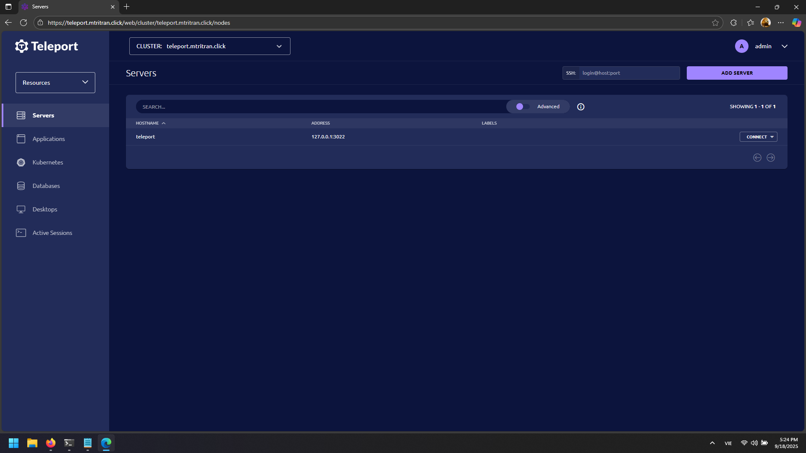
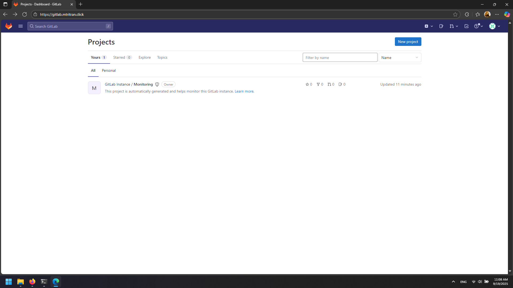
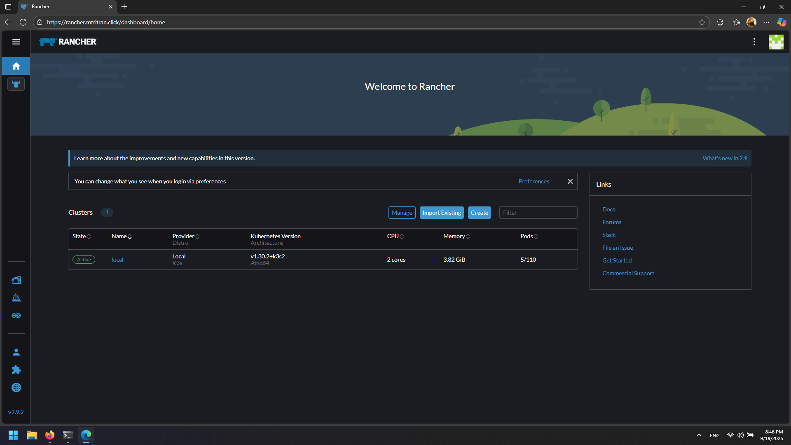
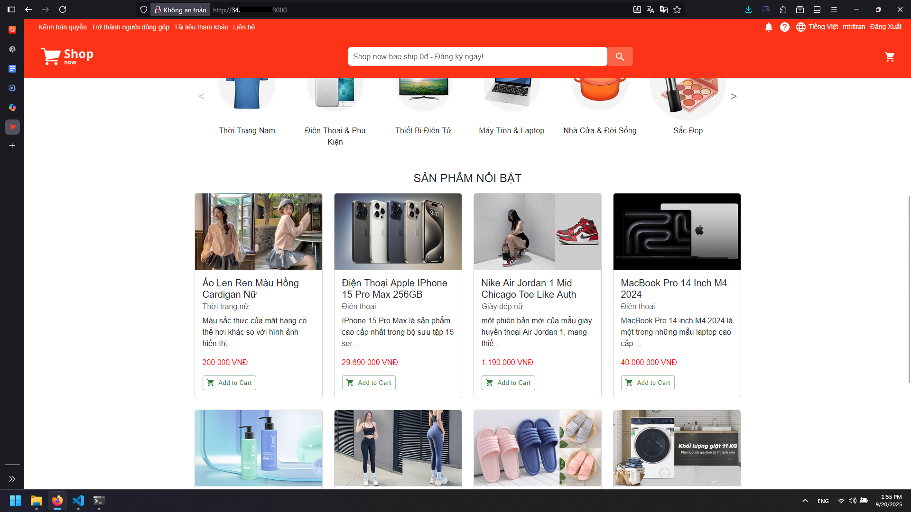
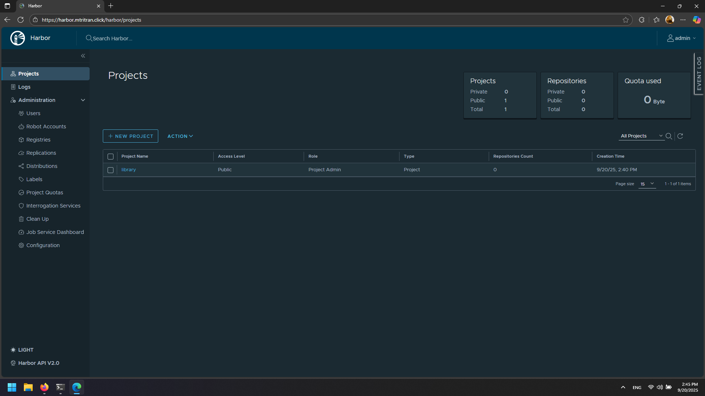

# DevOps Enterprise Project

## Overview
This project builds the infrastructure and deploys microservices in an end-to-end DevOps workflow on **Google Cloud**.

## Milestones
- **Milestone 1:** Domain + Teleport + Load Balancer (completed on 18/09/2025)  
- **Milestone 2:** GitLab + Rancher + Kubernetes Cluster (completed on 19/09/2025)  
- **Milestone 3:** Microservices deployment with Docker Compose (completed on 20/09/2025)  

## Documentation
- [Infrastructure](docs/infrastructure.md)
- [Domain Setup](docs/setup-domain.md)
- [Teleport Setup](docs/setup-teleport.md)  
- [Load Balancer Setup](docs/setup-lb.md)  
- [Teleport Server Management](docs/teleport-server-management.md)
- [GitLab Setup](docs/gitlab-setup.md)
- [Kubernetes Clusters Setup](docs/kubernetes-cluster-setup.md)
- [Rancher Setup](docs/rancher-setup.md)
- [Shopnow Project Analysis](docs/shopnow-project-analysis.md)
- [Deploy Microservice Application(Shopnow) With Docker Compose)](docs/microservices-app-deploy-docker-compose.md) 
- [Harbor Setup](docs/harbor-setup.md) 

## Results

**Teleport Dashboard**

**Gitlab Dashboard**

**Rancher Dashboard**

**Microservice Application Deploy With Docker Compose**

**Harbor Dashboard**

---

## Tech Stack
- **Cloud Provider:** Google Cloud Platform (GCP)  
- **Reverse Proxy & SSL:** Nginx + Let’s Encrypt (Certbot) 
- **Access Management:** Teleport   
- **DNS Management:** Cloudflare  
- **Orchestration & CI/CD:** Docker, Kubernetes, GitLab, Harbor (planned)  
- **Monitoring:** Prometheus + Grafana (planned)  

---

## Security Notes
- For security reasons, only the project domain (**mtritran.click**) is shown publicly.  
- All other sensitive details (e.g., IP addresses, API keys, emails, credentials) are replaced with placeholders in the documentation.  
- Full configuration is available upon request in a secure environment.
