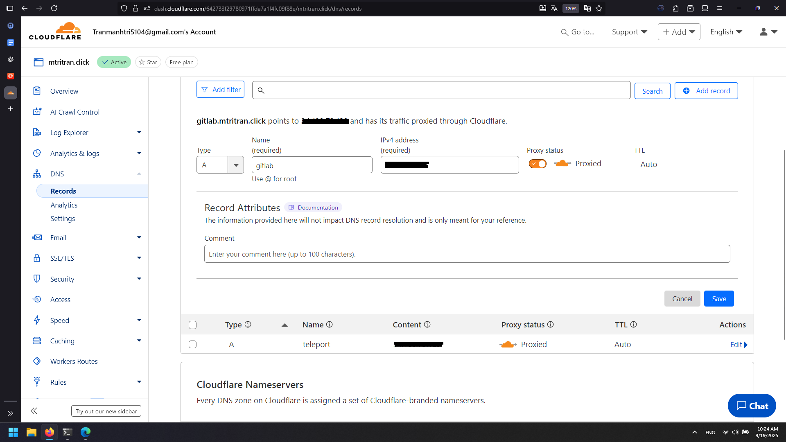
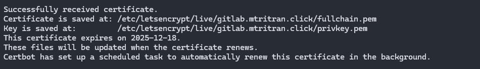
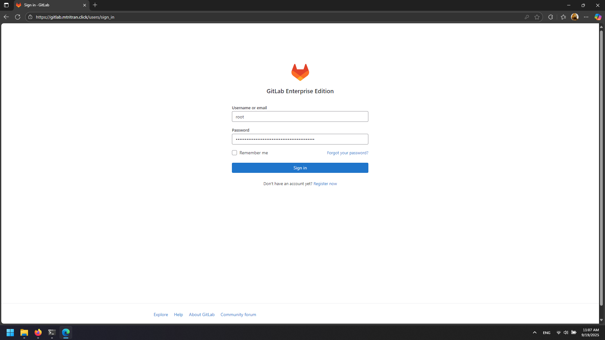

# GitLab Setup

## 1. Create GitLab Server

Create a new VM for GitLab with appropriate specifications on GCP.

## 2. Install GitLab

SSH into the GitLab server and run:

```bash
curl -s https://packages.gitlab.com/install/repositories/gitlab/gitlab-ee/script.deb.sh | sudo bash
apt install gitlab-ee=15.7.7-ee.0
```

## 3. Configure DNS

Add a new DNS record in Cloudflare:
- Name: `gitlab`
- IPv4 address: Load Balancer static IP



## 4. Generate SSL Certificate on Load Balancer

On the Load Balancer VM:

```bash
systemctl stop nginx
sudo certbot certonly --standalone -d gitlab.mtritran.click --preferred-challenges http --agree-tos -m <your-email@example.com> --keep-until-expiring
```

This will generate:
- `/etc/letsencrypt/live/gitlab.mtritran.click/fullchain.pem`
- `/etc/letsencrypt/live/gitlab.mtritran.click/privkey.pem`



## 5. Setup SSH Key for Certificate Transfer

### Copy SSH key to Load Balancer:

From your local machine:
```bash
scp -i "<path-to-your-key>" "<path-to-your-key>" <username>@<lb-public-ip>:/home/<username>/
```

### Setup SSH key on Load Balancer:

SSH into Load Balancer:
```bash
ssh -i "<path-to-your-key>" <username>@<lb-public-ip>
```

Then on Load Balancer:
```bash
sudo mkdir -p /root/.ssh
sudo mv /home/<username>/<your-key> /root/.ssh/<your-key>
sudo chmod 600 /root/.ssh/<your-key>
```

### Test SSH connection:
```bash
ssh -i /root/.ssh/<your-key> <username>@<gitlab-private-ip>
```

## 6. Transfer SSL Certificates to GitLab

From Load Balancer, transfer the certificates:

```bash
cd /etc/letsencrypt/live/gitlab.mtritran.click/
ssh -i /root/.ssh/<your-key> <username>@<gitlab-private-ip> "sudo tee /etc/gitlab/fullchain.pem > /dev/null" < fullchain.pem
ssh -i /root/.ssh/<your-key> <username>@<gitlab-private-ip> "sudo tee /etc/gitlab/privkey.pem > /dev/null" < privkey.pem
```

## 7. Configure GitLab SSL

On GitLab server:

```bash
cd /etc/gitlab/
sudo chmod 600 /etc/gitlab/fullchain.pem
sudo chmod 600 /etc/gitlab/privkey.pem
nano gitlab.rb
```

Edit the following sections in `gitlab.rb`:

**External URL:**
```ruby
external_url 'https://gitlab.mtritran.click'
```

**Nginx configuration:**
```ruby
nginx['enable'] = true
nginx['ssl_certificate'] = "/etc/gitlab/fullchain.pem"
nginx['ssl_certificate_key'] = "/etc/gitlab/privkey.pem"
```

Apply configuration:
```bash
gitlab-ctl reconfigure
```

## 8. Configure Load Balancer for GitLab

On Load Balancer:

```bash
cp /etc/nginx/conf.d/teleport.conf /etc/nginx/conf.d/gitlab.conf
nano /etc/nginx/conf.d/gitlab.conf
```

GitLab configuration:
```nginx
server {
    server_name gitlab.mtritran.click;
    location / {
        proxy_pass https://<gitlab-private-ip>:443;
        proxy_http_version 1.1;
        proxy_set_header Host $host;
        proxy_set_header Upgrade $http_upgrade;
        proxy_set_header Connection "upgrade";
        proxy_set_header X-Real-IP $remote_addr;
        proxy_set_header X-Forwarded-For $proxy_add_x_forwarded_for;
        proxy_set_header X-Forwarded-Proto $scheme;
    }
    listen 443 ssl;
    ssl_certificate /etc/letsencrypt/live/gitlab.mtritran.click/fullchain.pem;
    ssl_certificate_key /etc/letsencrypt/live/gitlab.mtritran.click/privkey.pem;
}

server {
    if ($host = gitlab.mtritran.click) {
        return 301 https://$host$request_uri;
    }
    listen 80;
    server_name gitlab.mtritran.click;
    return 404;
}
```

Restart Nginx:
```bash
systemctl restart nginx
```

## 9. Get Initial Root Password

On GitLab server:
```bash
cat /etc/gitlab/initial_root_password
```

## 10. Access GitLab

Open https://gitlab.mtritran.click in browser
- Username: `root`
- Password: Use the password from step 9



GitLab should now be accessible via HTTPS through your Load Balancer.