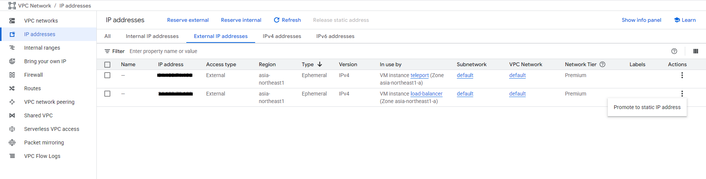
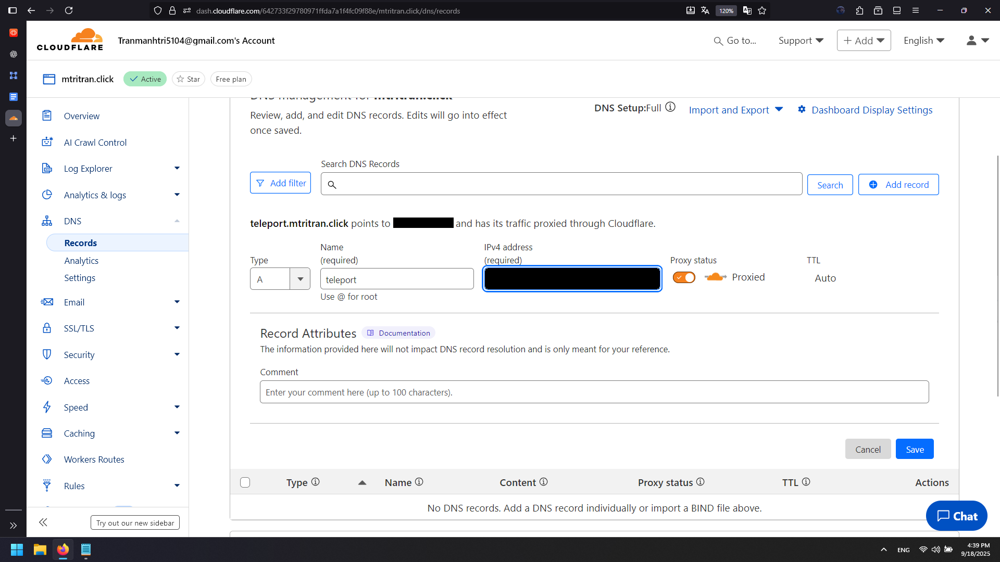

# Infrastructure Setup

## Overview

This project runs on **Google Cloud Platform (GCP)** using Virtual Machines (VMs).  
Each service is deployed on a dedicated VM, connected via private IPs inside the same VPC network.  
A Load Balancer VM is responsible for handling all external traffic.

## Servers

### 1. Load Balancer
- **Name:** load-balancer  
- **Machine type:** e2-small (2 vCPU, 2 GB RAM)  
- **OS:** Ubuntu 22.04 LTS  
- **Role:**  
  - Exposes a static public IP  
  - Manages SSL certificates (via Certbot)  
  - Acts as reverse proxy (Nginx) to backend services (Teleport, GitLab, Rancher…)

### 2. Teleport
- **Name:** teleport  
- **Machine type:** e2-small (2 vCPU, 2 GB RAM)  
- **OS:** Ubuntu 22.04 LTS  
- **Role:**  
  - Provides secure access management (SSH & Web UI)  
  - Accessible only through the Load Balancer  

## Networking

- **VPC:** Default VPC with private subnets  
- **Private communication:** VMs communicate via internal IPs (10.x.x.x range)  
- **Public access:** Only the Load Balancer has a static public IP  
- **Domain:** `mtritran.click` configured via Cloudflare DNS  

## Setup Steps

### 1. Create Virtual Machines

Create the Load Balancer VM with e2-small configuration and Ubuntu 22.04 LTS.
Create the Teleport VM with similar specifications.

### 2. Configure Static IP and DNS

**Convert Load Balancer IP to Static:**
1. Go to VPC Network > IP addresses > External IP addresses
2. Find the Load Balancer VM's IP address
3. Change from "Ephemeral" to "Static"
4. Give it a name (e.g., "lb-static-ip")

**Configure Cloudflare DNS:**
1. Go to Cloudflare DNS management
2. Create a new A record:
   - Name: `teleport`
   - IPv4 address: Load Balancer static IP
   - Proxy status: DNS only 
3. Save the record

The domain `teleport.mtritran.click` will now point to your Load Balancer's static IP.