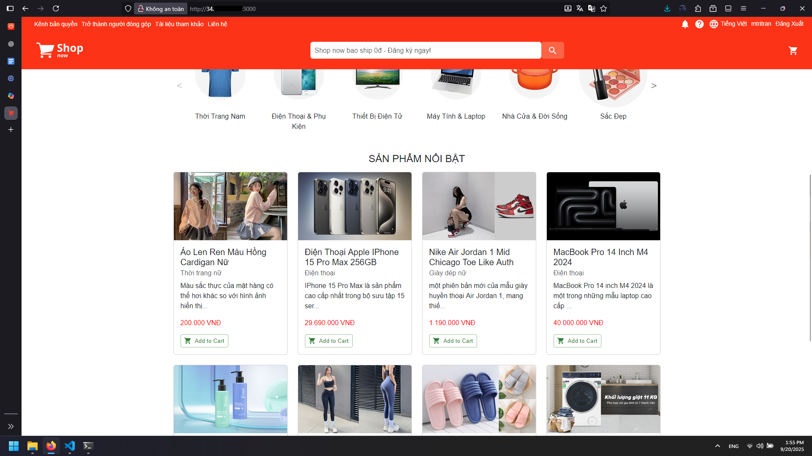

# Application Deployment with Docker Compose

## Overview

This guide demonstrates deploying a microservices application (Shopnow) using Docker Compose on a development server.

## 1. Prepare Development Server And Source Code:

### Convert IP to Static:
1. Go to VPC Network > IP addresses > External IP addresses  
2. Find the Development server's IP address
3. Change from "Ephemeral" to "Static"
4. Note the static IP address for configuration


### Update IP in `.env` file
1. Open the `.env` file in the frontend project.  
2. Replace the current IP address with the **public IP of the Dev Server**.  


### Install Docker:
```bash
apt install docker.io docker-compose -y
```

## 2. Transfer Application Code

### From local machine:
```bash
scp -i "<path-to-your-key>" ./Shopnow.zip <username>@<dev-server-public-ip>:/home/<username>/
```

### On development server:
```bash
sudo mv /home/<username>/Shopnow.zip /root/
cd /root
apt install unzip
unzip Shopnow.zip
```

## 3. Prepare Application Files

### Fix Maven wrapper permissions:
```bash
cd Shopnow/
find . -name mvnw -exec chmod +x {} \;
```

Verify permissions:
```bash
find . -name mvnw -exec ls -l {} \;
```

## 4. Deploy Backend Services

Navigate to backend directory:
```bash
cd shopnow-backend/
```

### Build and start all microservices:
```bash
docker-compose up --build
```

For background deployment:
```bash
docker-compose up --build -d
```


## 5. Configure Firewall

Open required ports for backend services:
- Port 8761: Eureka Discovery Server
- Port 5863: Shopping Cart Service  
- Port 5865: User Service
- Port 5861: Product Service
- Port 8080: Keycloak Authentication
- Port 5860: API Gateway

Add firewall rules in GCP Console:
1. Go to VPC Network > Firewall
2. Create rules for each port above
3. Source IP ranges: 0.0.0.0/0 (for development)
4. Target: All instances in the network

## 6. Verify Backend Services

Access the following URLs to verify services:

- **Eureka Dashboard**: `http://<dev-server-ip>:8761`


- **Shopping Cart API**: `http://<dev-server-ip>:5863/swagger-ui.html`


- **User API**: `http://<dev-server-ip>:5865/swagger-ui.html`  


- **Product API**: `http://<dev-server-ip>:5861/swagger-ui.html`


- **Keycloak**: `http://<dev-server-ip>:8080`


## 7. Deploy Frontend Application

### Build frontend image:
```bash
cd ../shopnow-frontend/
docker build -t shopnow-frontend:v1 .
```

### Run frontend container:
```bash
docker run --name shopnow_frontend -dp 3000:3000 shopnow-frontend:v1
```

### Add firewall rule for port 3000:
Configure GCP firewall to allow port 3000 for frontend access

### Access the Application

- Open `http://<dev-server-public-ip>:3000` in your browser


- Register a new account


- Log in with the account you just created 

- Navigate to the **Products** section (initially it should be empty)


## 8. Configure Application Data

### Access PostgreSQL database:
```bash
docker exec -it shopnow-backend_postgres_1 bash
su postgres
psql
```

### Connect to application database:
```sql
\c postgres
\d
```

### Insert sample product data:
```sql
INSERT INTO public.product (id,category,description,"name",price) VALUES
(3,'Thời trang nữ','Màu sắc thực của mặt hàng có thể hơi khác so với hình ảnh hiển thị trên trang web','Áo len ren màu hồng cardigan nữ',200000),
(2,'Điện thoại','IPhone 15 Pro Max là sản phẩm cao cấp nhất trong bộ sưu tập 15 series','Điện thoại Apple iPhone 15 Pro Max 256GB',29690000),
(4,'Giày dép nữ','một phiên bản mới của mẫu giày huyền thoại Air Jordan 1','Nike Air Jordan 1 Mid Chicago Toe Like Auth',1190000),
(5,'Điện thoại','MacBook Pro 14 inch M4 2024 là một trong những mẫu laptop cao cấp của Apple','MacBook Pro 14 inch M4 2024',40000000),
(6,'Sắc đẹp','Emmié Soothing & Hydrating Derma Cleansing chính là Gel rửa mặt B5 chuyên dụng tại SPA','Gel Rửa Mặt Emmié Soothing',280000),
(7,'Thời trang nữ','Chiếc quần legging với thiết kế cao cấp, cách điệu cạp chéo','Quần Tập Gym Nữ Cạp Chéo',299000),
(8,'Thời trang','Đế dép thường được thiết kế chống trượt, giúp di chuyển an toàn trên sàn nhà','Dép đi trong nhà siêu xinh nam nữ',387000),
(9,'Thiết bị điện tử','Công nghệ UltraMix hòa tan bột giặt trước khi giặt nâng cao hiệu quả giặt','Máy giặt Electrolux Inverter 11 kg',15690000);
```

## 9. Reload the Application

- Refresh the page.  
- The **Products** section should now display the available products.  



## Architecture Overview

The deployed application consists of:

- **Discovery Server** (Eureka): Service registration and discovery
- **Config Server**: Centralized configuration management
- **API Gateway**: Single entry point for all client requests
- **Product Service**: Product catalog management
- **User Service**: User management and authentication
- **Shopping Cart Service**: Shopping cart functionality
- **Keycloak**: Identity and access management
- **PostgreSQL**: Primary database
- **MySQL**: Keycloak database
- **React Frontend**: User interface

All services communicate through the service registry and are accessible via the API Gateway for a unified microservices architecture.