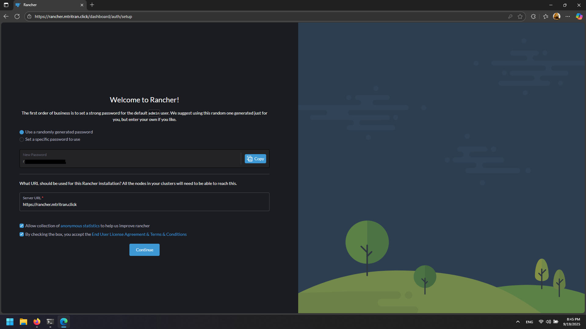
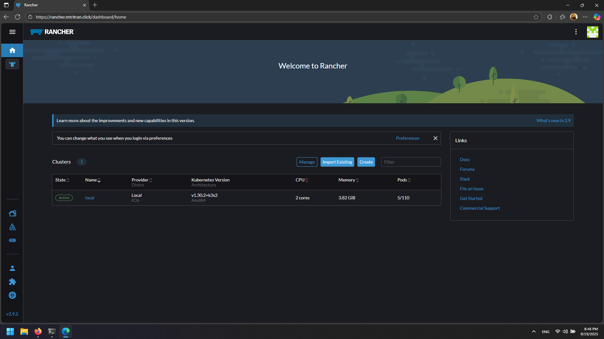
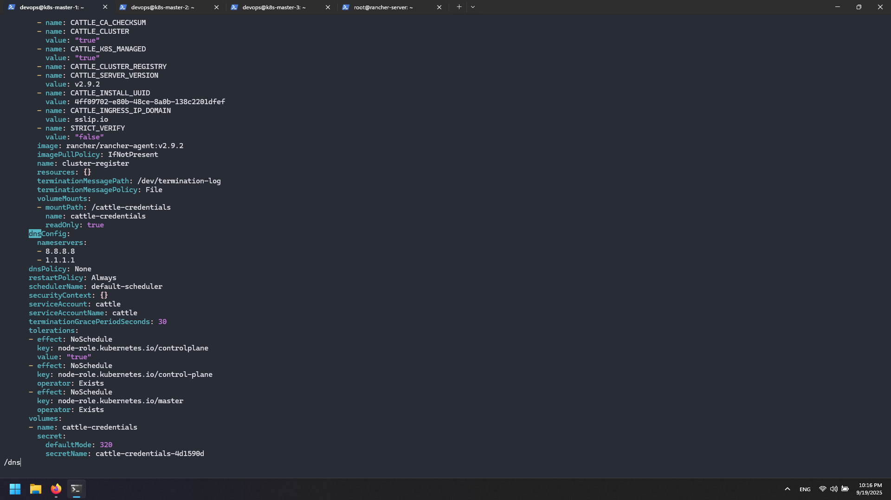

# Rancher Setup

## Overview

This guide sets up Rancher server using Docker Compose for Kubernetes cluster management.

## 1. Install Docker and Docker Compose

SSH into the Rancher server:

```bash
apt install docker.io docker-compose -y
docker -v && docker-compose -v
```

## 2. Create Rancher Docker Compose

Create the Docker Compose configuration:

```bash
nano docker-compose.yml
```

```yaml
version: '3'
services:
  rancher-server:
    image: rancher/rancher:v2.9.2
    container_name: rancher-server
    restart: unless-stopped
    ports:
      - "80:80"
      - "443:443"
    volumes:
      - ./data/:/var/lib/rancher
    command:
      - --no-cacerts
    environment:
      - CATTLE_AGENT_TLS_MODE=system-store
    privileged: true
```

Start Rancher:
```bash
docker-compose up -d
```

## 3. Configure DNS and SSL

### Add Cloudflare DNS Record:
1. Go to Cloudflare DNS management
2. Create a new A record:
   - Name: `rancher`
   - IPv4 address: Load Balancer static IP


### Generate SSL Certificate on Load Balancer:

```bash
systemctl stop nginx
sudo certbot certonly --standalone -d rancher.mtritran.click --preferred-challenges http --agree-tos -m <your-email@example.com> --keep-until-expiring
```

## 4. Configure Load Balancer for Rancher

On Load Balancer VM:

```bash
cp /etc/nginx/conf.d/gitlab.conf /etc/nginx/conf.d/rancher.conf
nano /etc/nginx/conf.d/rancher.conf
```

Update the configuration:
```nginx
server {
    server_name rancher.mtritran.click;
    location / {
        proxy_pass https://<rancher-private-ip>:443;
        proxy_http_version 1.1;
        proxy_set_header Host $host;
        proxy_set_header Upgrade $http_upgrade;
        proxy_set_header Connection "upgrade";
        proxy_set_header X-Real-IP $remote_addr;
        proxy_set_header X-Forwarded-For $proxy_add_x_forwarded_for;
        proxy_set_header X-Forwarded-Proto $scheme;
    }
    listen 443 ssl;
    ssl_certificate /etc/letsencrypt/live/rancher.mtritran.click/fullchain.pem;
    ssl_certificate_key /etc/letsencrypt/live/rancher.mtritran.click/privkey.pem;
}

server {
    if ($host = rancher.mtritran.click) {
        return 301 https://$host$request_uri;
    }
    listen 80;
    server_name rancher.mtritran.click;
    return 404;
}
```

Restart Nginx:
```bash
systemctl restart nginx
```

## 5. Get Rancher Bootstrap Password

Check the Rancher container logs for the bootstrap password:

```bash
docker ps -a
docker logs <container-id> 2>&1 | grep "Bootstrap Password:"
```

Example output:
```
Bootstrap Password: wlghdjlhdhqrv4cngvgtkmqszpckcshkr4zsjfv6bq4m2tgwsh4cjd
```

## 6. Initial Rancher Setup

1. Open https://rancher.mtritran.click in browser


2. Enter the bootstrap password


3. Set new admin password



4. Accept terms and continue

## 7. Import Existing Kubernetes Cluster

### In Rancher Web UI:
1. Click "Import Existing" cluster



2. Select "Generic" 


3. Give your cluster a name


4. Click "Create"

5. Copy the generated kubectl command


### On Kubernetes Master 1 Node:
Run the command provided by Rancher:
```bash
kubectl apply -f https://rancher.mtritran.click/v3/import/<cluster-token>.yaml
```

### Verify Import:
```bash
kubectl get po --all-namespaces
kubectl get po -n cattle-system
```

## 8. Fix DNS Resolution Issues (if needed)

If cattle-cluster-agent cannot resolve rancher.mtritran.click:

### Check logs:
```bash
kubectl logs -n cattle-system -l app=cattle-cluster-agent
```

### If DNS resolution fails, fix the deployment:
```bash
kubectl -n cattle-system edit deployment cattle-cluster-agent
```

Find `dnsPolicy: ClusterFirst` and replace with:
```yaml
dnsConfig:
  nameservers:
  - 8.8.8.8
  - 1.1.1.1
dnsPolicy: None
```



### Restart deployment:
```bash
kubectl -n cattle-system rollout restart deploy cattle-cluster-agent
kubectl -n cattle-system delete pod -l app=cattle-cluster-agent
```

### Verify fix:
```bash
kubectl -n cattle-system logs -l app=cattle-cluster-agent --tail=50 -f
```

Look for: `INFO: https://rancher.mtritran.click/ping is accessible`


## 9. Add Servers to Teleport Management

Add all Kubernetes nodes and Rancher server to Teleport:

```bash
sudo bash -c "$(curl -fsSL https://teleport.mtritran.click/scripts/<your-token>/install-node.sh)"
```

Run this command on:
- k8s-master-1
- k8s-master-2  
- k8s-master-3
- rancher-server


Your Kubernetes cluster is now managed by Rancher and accessible via https://rancher.mtritran.click