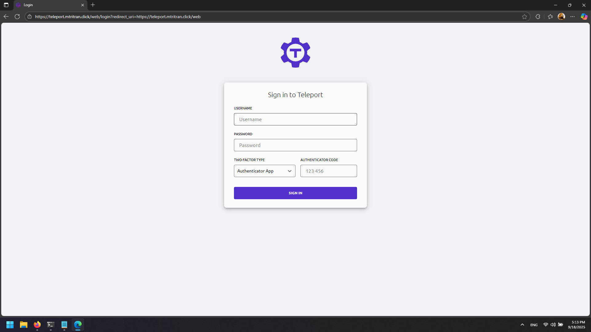

# Load Balancer Setup (Nginx + Certbot)

## 1. Install Dependencies

On the Load Balancer VM:

```bash
apt update
apt install -y nginx apache2-utils certbot python3-certbot-nginx
```

## 2. Obtain SSL Certificate

Stop Nginx to free port 80:

```bash
systemctl stop nginx
```

Request certificate from Let's Encrypt:

```bash
sudo certbot certonly --standalone -d teleport.mtritran.click --preferred-challenges http --agree-tos -m <your-email@example.com> --keep-until-expiring
```

Certificates are saved in:
- /etc/letsencrypt/live/teleport.mtritran.click/fullchain.pem
- /etc/letsencrypt/live/teleport.mtritran.click/privkey.pem

## 3. Configure Nginx Reverse Proxy

```bash
nano /etc/nginx/conf.d/lb.conf
```

Configuration:

```nginx
server {
    server_name teleport.mtritran.click;
    location / {
        proxy_pass https://<Teleport-Private-IP>:443;
        proxy_http_version 1.1;
        proxy_set_header Host $host;
        proxy_set_header Upgrade $http_upgrade;
        proxy_set_header Connection "upgrade";
        proxy_set_header X-Real-IP $remote_addr;
        proxy_set_header X-Forwarded-For $proxy_add_x_forwarded_for;
        proxy_set_header X-Forwarded-Proto $scheme;
    }
    listen 443 ssl;
    ssl_certificate /etc/letsencrypt/live/teleport.mtritran.click/fullchain.pem;
    ssl_certificate_key /etc/letsencrypt/live/teleport.mtritran.click/privkey.pem;
}

server {
    if ($host = teleport.mtritran.click) {
        return 301 https://$host$request_uri;
    }
    listen 80;
    server_name teleport.mtritran.click;
    return 404;
}
```

Restart Nginx:

```bash
systemctl restart nginx
```

## 4. Verify

Open https://teleport.mtritran.click in a browser.
Teleport should be accessible over HTTPS, secured with Let's Encrypt certificate.

