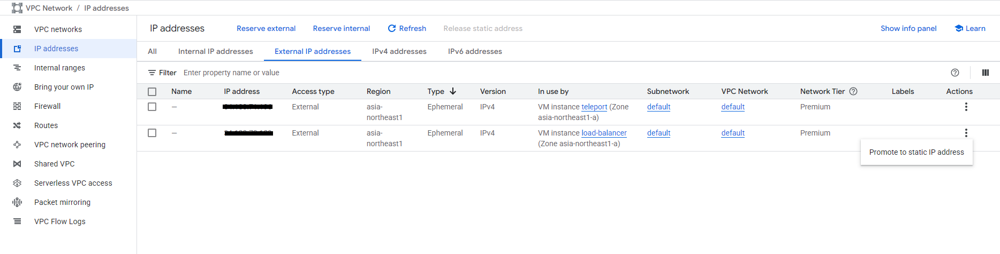

# Teleport Setup

## 1. Convert Load Balancer IP to Static and Add Subdomain

### Convert Load Balancer IP to Static:
1. Go to VPC Network > IP addresses > External IP addresses
2. Find the Load Balancer VM's IP address
3. Change from "Ephemeral" to "Static"
4. Give it a name (e.g., "lb-static-ip")



### Configure Cloudflare DNS:
1. Go to Cloudflare DNS management
2. Create a new A# Teleport Setup


## 1. Install Teleport

On the Teleport VM:

```bash
wget https://get.gravitational.com/teleport-v13.2.0-linux-amd64-bin.tar.gz
tar -xzf teleport-v13.2.0-linux-amd64-bin.tar.gz
mv teleport/tctl /usr/local/bin/
mv teleport/tsh /usr/local/bin/
mv teleport/teleport /usr/local/bin/
teleport version && tctl version && tsh version
```

## 2. Create Teleport Configuration

```bash
mkdir -p /etc/teleport
nano /etc/teleport/teleport.yaml
```

```yaml
version: v3
teleport:
  nodename: teleport
  data_dir: /var/lib/teleport
  log:
    output: stderr
    severity: INFO
    format:
      output: text
  ca_pin: ""
  diag_addr: ""
auth_service:
  enabled: "yes"
  listen_addr: 0.0.0.0:3025
  cluster_name: teleport.mtritran.click
  proxy_listener_mode: multiplex
ssh_service:
  enabled: "yes"
proxy_service:
  enabled: "yes"
  web_listen_addr: 0.0.0.0:443
  public_addr: teleport.mtritran.click:443
  https_keypairs: []
  https_keypairs_reload_interval: 0s
```

## 3. Create Teleport Service

```bash
nano /etc/systemd/system/teleport.service
```

```ini
[Unit]
Description=Teleport Service
Documentation=https://gravitational.com/teleport/docs
After=network.target

[Service]
User=root
ExecStart=/usr/local/bin/teleport start --config=/etc/teleport/teleport.yaml
Restart=on-failure
LimitNOFILE=65536

[Install]
WantedBy=multi-user.target
```

## 4. Reload and start service

```bash
systemctl daemon-reload
systemctl start teleport
systemctl status teleport
```

## 5. Create an Admin User

```bash
tctl users add admin --roles=editor,access --logins=root
```

This generates a one-time signup link. Open the link in a browser, register with Google Authenticator, and log in to the Teleport Web UI.

teleport-authen

